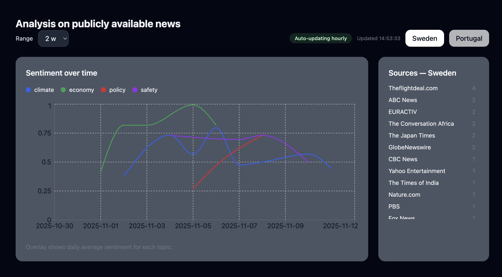

# Political Discourse Dashboard

A full‑stack, ML‑powered dashboard that analyzes news sentiment across **Sweden** and **Portugal**.

This project pulls real news articles, runs sentiment analysis with a Hugging Face model, stores insights in PostgreSQL, and shows trends in a React dashboard.

Built to demonstrate modern full‑stack engineering, API design, cloud deployment, and real‑world ML integration.

## Live Demo
Check it out 👉 [here](https://political-discourse-news-web.vercel.app//)

- **Frontend**: Vercel  
- **Backend API** (API and database): Railway

## What This Project Shows
- Full‑stack TypeScript (React, Express, Prisma)
- Real ML integration with Hugging Face sentiment analysis
- Automated data ingestion + scheduled jobs
- Clean API design with Zod validation & Prisma ORM
- Cloud deployment (Vercel + Railway)
- Interactive charts with Recharts
- Monorepo with pnpm workspaces

> This is a production‑ready system: ingest → analyze → store → visualize.

## Features

### ML Sentiment Analysis
Uses `distilbert-base-uncased-finetuned-sst-2-english` → maps to **0–1 score**.

### Automated News Ingestion
Cron job runs **hourly**. Falls back to **mock data** on rate limits.

### Multi‑Topic Trends
Tracks:
- Climate
- Economy
- Policy
- Safety

Time ranges: **1–4 weeks**  
Switch between **Sweden / Portugal**

### Dashboard
- Responsive UI
- Smooth curves
- Color legend
- Source list
- Auto‑update badge

## Tech Stack

**Frontend**  
React, TypeScript, Vite, TailwindCSS, Recharts

**Backend**  
Node.js, Express, Prisma, PostgreSQL, Hugging Face API, node‑cron

**Infra**  
Vercel (web), Railway (API + DB), pnpm monorepo

## Environment Variables

### API (`apps/api/.env`)
```env
DATABASE_URL=your_postgres_url
HF_API_KEY=your_huggingface_key
NEWSAPI_KEY=your_newsapi_key
ENABLE_INGESTION=true
```

### Frontend (`apps/web/.env`)
```env
VITE_API_BASE="https://your-api.up.railway.app"
```

## Running Locally
```env
pnpm install
pnpm dev
textOptional mock data:
cd apps/api
pnpm tsx prisma/seed_mock.ts
```

## Deployment

### Railway (API)
- Deploy `apps/api`
- Attach PostgreSQL
- Add env vars
- Runs:
```env
pnpm -C apps/api build
pnpm -C apps/api start
```

### Vercel (Frontend)
- Deploy `apps/web`
- Set `VITE_API_BASE` to Railway URL

## About This Project

Demonstrates:
- End‑to‑end system design
- Real ML in production
- Clean API & frontend engineering
- Cloud‑native workflows